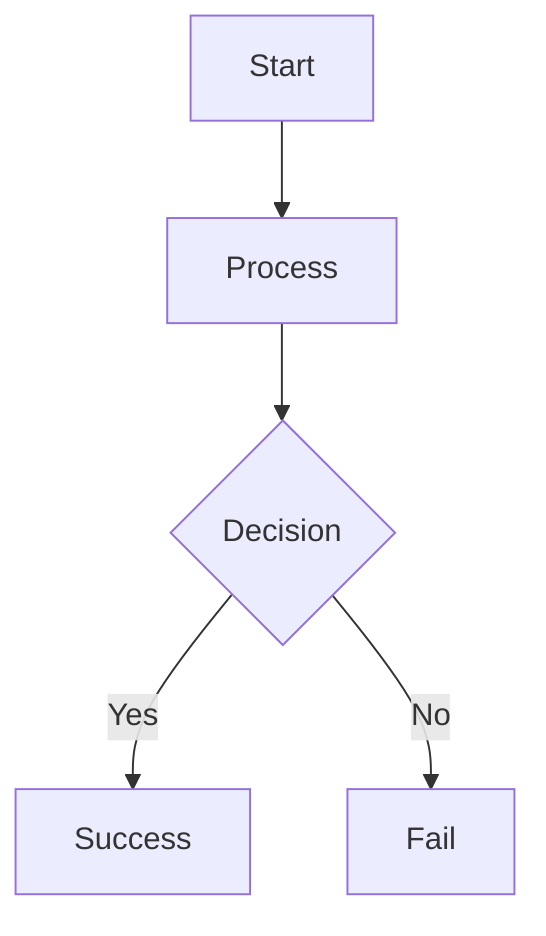

It's probably bad news if I have a Saturday afternoon and evening spare, a
fully-charged laptop and a comfy sofa. It seems that when that happens,
something like [BlogMore
v2.41.0](https://blogmore.davep.dev/changelog/#v2410) happens. This is a
release where I've added two features that could be generally useful, but
which I'm unlikely to use in my own blogs.

The first, which to be fair is one I *might* use (I've used it in
documentation plenty of times over the years), is optional
[Mermaid](https://mermaid.ai/open-source/) support. This is off by default,
so has no overhead if you don't turn it on. It is turned on [by setting
`with_mermaid` to
`true`](https://blogmore.davep.dev/configuration/#with_mermaid). Even with
this enabled, the Mermaid third-party scripts only get included on pages
that include a Mermaid diagram, reducing the overhead.

To include a Mermaid diagram you [use a fenced codeblock with `mermaid` as
the language
identifier](https://blogmore.davep.dev/writing_a_post/#diagrams-mermaid).
For example:

````markdown

````

If Mermaid is enabled the resulting page will show this:


There are, of course, all sorts of diagrams that can be used and I'm not
going to go into them here, or in the [BlogMore
docs](https://blogmore.davep.dev/); Mermaid is well known enough and
well-documented enough that anyone turning this on is likely to know what
they're doing, or where to go to find out what to do.

The second new feature, which I am almost certainly *never* going to need to
use on my blog, is [LaTeX-style maths
support](https://blogmore.davep.dev/writing_a_post/#latex-math-rendering).
As with Mermaid, this is off by default and has no overhead if not used.
Even when [turned on with the `with_maths`
setting](https://blogmore.davep.dev/configuration/#with_maths), the external
scripts will only be pulled into pages that include maths markup.

Two providers of rendering engines are supported and this [can be configured
with the `maths_provider`
setting](https://blogmore.davep.dev/configuration/#maths_provider). The
available options are [`katex`](https://katex.org/) (which is also the
default) and [`mathjax`](https://www.mathjax.org/).

To use either, when turned on, you use the usual `$` or `$$` convention for
LaTeX-maths-in-Markdown:

```markdown
You can make some fun images using:

$$
z_{n+1} = z_n^2 + c
$$

We can say $z_{n+1} = z_n^2 + c$ inline too.
```

The result of the above will be something like:


Note that some care has been taken to ensure that ordinary use of a `$`, in
currency values for example, is left unaffected. This can't be guaranteed in
every possible case, so keep this in mind when turning on `with_maths`. From
what I have read this is a common issue when using such markup.

Both these features were fun to add, with me planning out the implementation
with [Antigravity](/tag/antigravity/), and having a back and forth a couple
of times to address issues and get it all working "just so". I'm especially
pleased with the fact that it's done in a way where there is no overhead,
even when either feature is enabled, if a page isn't showing a diagram or
maths markup.

[//]: # (2026-06-07-blogmore-v2-41-0.md ends here)
